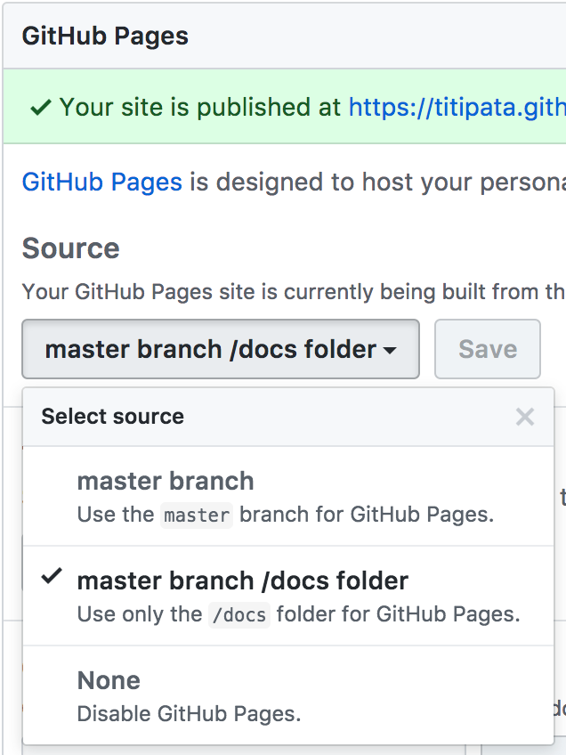

## Weather Forecast

See Chicago weather forecast at [titipata.github.io/forecast](https://titipata.github.io/forecast/).
To serve the site locally, run `jekyll serve` in `docs` folder.

### Get your own weather forecast

- Fork the repository
- Change city by edit `location` in `docs/_includes/scripts.html`
- Edit Github pages section in `Settings` to `master branch /docs` folder
in order to publish your page on `<profile_name>.github.io/forecast`

  

